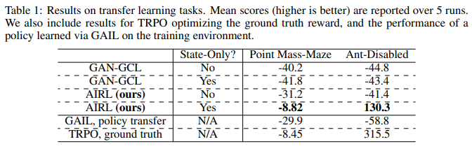
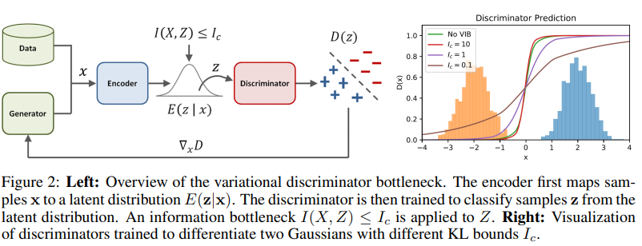

# Advancements in Inverse Reinforcement Learning

Mauricio Garcia Tec

October 2019

The University of Texas at Austin

---

## Notation

- $\mathcal{S}$: state space
- $\mathcal{A}$: action pace
- $r$: reward function
- $\pi(a \mid s)$: policy function
- $p(\tau)$: true (experts') induced distribution over trajectories
- $\tau=((s_0, a_0), ..., (s_T, a_T))$: a trajectory of state-action pairs
- $\mathcal{D}=(\tau_1,...,\tau_N)$: a dataset of experts' demonstrations

<!-- - $\gamma$: time-discount factor -->

---

## Background 

In the MaxEnt framework (Todorov, 2008) of RL, the goal is to find a policy $\pi$ such that trajectories sampled follow a distribution

$$
p(\tau) = \frac{1}{Z} \exp R(\tau)
$$

where $R(\tau):=\sum_t r(s_t, a_t)$. The function $r$ is assumed to be determinisitic. Conversely, in inverse RL (within MaxEnt framework) we are presented an experts' policy $\pi^{(e)}$ and want to solve

$$
\max_{r} \; \mathbb{E}_{\tau \sim p} \left[ R(\tau) - \log Z(r) \right]
$$

---

<!-- The problem is actually ill-defined an in order to make it convex Ziebart et al. (2010) introduce a convex regularizer $\mathcal{H}^\text{causal}(\theta):= \mathbb{E}_{\rho^\pi(s)}[]$ 

--- -->

## Paper 1: GAN-GCL (GAN guided cost learning)

Finn, C., Christiano, P., Abbeel, P., & Levine, S. (2016). A connection between generative adversarial networks, inverse reinforcement learning, and energy-based models. In: NeurIPS 2016.

--- 

## IRL as MLE

We can interpret it as a maximum likelihood problem

$$
\min_\theta \; \mathbb{E}_{\tau \sim p}\left[ - \log p_\theta(\tau)\right]
$$

where $p_\theta(\tau)=\frac{1}{Z}\exp(-c_\theta(\tau))$ is parametrized by the **Boltzmann distribution**.

---

Typical problem with Boltzmann distribution is estimating the partition function $Z$. Let $c_\theta(\tau)$ be the energy cost function (think of a negative reward). And assume we can sample from another policy with known density $\pi$. Then
$$
Z= \int \exp(-c_\theta(\tau)) d\tau=\int \exp(-c_\theta(\tau))\frac{\mu(\tau)}{\mu(\tau)} d\tau = \mathbb{E}_{\tau \sim \mu} \left[ \frac{\exp(-c_\theta(\tau))}{\mu(\tau)} \right]
$$
Then we have a loss function for the parameters $\theta$:
$$
\begin{aligned}
\mathcal{L}_\text{IRL}(\theta) & = \mathbb{E}_{\tau\sim p}[-\log p_\theta(\tau)] \\
    & = \mathbb{E}_{\tau \sim p}[c_\theta(\tau)]  + \log Z \\
    & = \mathbb{E}_{\tau \sim p}[c_\theta(\tau)] +  \log \mathbb{E}_{\tau \sim \mu} \left[ \frac{\exp(-c_\theta(\tau))}{\mu(\tau)} \right]
\end{aligned}
$$

---

The optimal importance sampling for this function is precisely proportional to $p$ [discussion]. We can train any $\mu$ to be as close as possible but with a regularization entropy term
$$
\mathcal{L}_\text{sampler}(\mu) = \mathbb{E}_{\tau \sim \mu}[c_\theta(\tau)] +  \mathbb{E}_{\tau \sim \mu} [\log q(\tau)]
$$

We now take a look at cost-guided GANs and explore the connection.

---

## GANs

For a true data distribution $p$ and generator distribution $\pi$ the discriminator's objective in GAN is
$$
\mathcal{L}_\text{discriminator}(D_\theta) = \mathbb{E}_{\tau \sim p} [-\log D_\theta(\tau)] + \mathbb{E}_{\tau \sim \pi} [ -\log(1 - D_\theta(\tau))]
$$
And the generator objective is
$$
\mathcal{L}_\text{generator}(\pi) = \mathbb{E}_{\tau \sim \pi} [-\log D_\theta(\tau)] + \mathbb{E}_{\tau \sim \pi} [ \log(1 - D_\theta(\tau))]
$$

---

## Cost-guided GANs

For a **fixed** generator with $\pi(\tau)$, the optimal discriminator is
$$
D^*(\tau) = \frac{p(\tau)}{p(\tau) + \pi(\tau)}
$$
where $p(\tau)$ is the actual distribution of the data. 

Moreover, the global minumum of $D_*(\tau)$ is obtained when $\pi \equiv p$,at which the discriminator gives equal probability to fake and generated data.

---

When the density of $\pi$ can be evaluated, GAN can be modified to estimate $p$
$$
D_\theta(\tau) = \frac{p_\theta(\tau)}{p_\theta(\tau) + \pi(\tau)} = 
\frac{\frac{1}{Z}\exp(-c_\theta(\tau))}{\frac{1}{Z}\exp(-c_\theta(\tau)) + \pi(\tau)}
$$
at optimality, $p_\theta(\tau)=\frac{1}{Z}\exp(-c_\theta(\tau)) = p(\tau)$.

---

## Cost-guided GANs solve IRL

Here is another trick. Let $\mu$ be a mixture of the data and policy samples $\mu(\tau) = \frac{1}{2}(p(\tau) + \pi(\tau))$. This $\mu$ can be used for the importace sampling estimate:

The authors prove three foundational results:

1. The value of $Z$ which minimizes $\mathcal{L}_\text{discriminator}$ is the importance sampling estimate of $Z$ using $\mu$.
2. For this value of $Z$ the derivative, $\partial_\theta \mathcal{L}_\text{discriminator} = \partial_\theta \mathcal{L}_\text{IRL}$. Thus the discriminator optimizes $\mathcal{L}_\text{IRL}$.
3. The generator's loss satisfies $\mathcal{L}_\text{generator}(\pi) = \log Z + \mathcal{L}_\text{sampler}(\pi)$.

---

## Conclusion

- Using GAN is equivalent to IRL on trajectories
- Putting a special structure on the discriminator can be used to estimate the expert's policy $p(\tau)$, which in turns gives an estimate of the cost/reward of trajectory
- No examples given by the authors. Why can that be?

---

## Paper 2: Adversarial Inverse Reinforcement Learning (AIRL)

Fu, J., Luo, K., & Levine, S. (2018). *Learning Robust Rewards with Adverserial Inverse Reinforcement Learning.* In: ICLR.

---

## State-action centric vs trajectory-centric

The GAN-GCL of Finn et al. (2016) is trajectory-centric, which gives in high-variance estimates and results in very poor learning.

The goal will be to be able to learn rewards for each state-action pair instead. The problem to solve is **reward entanglement**.

---

## State-action version

Obvious idea is to use GAN-GCL at the state-action level using a discriminator of the form

$$
D_\theta(s, a)  = 
\frac{\exp(f_\theta(s, a))}{\exp(f_\theta(s, a)) + \pi(a\mid s)}
$$

- $f_\theta$ serves the experts reward function
- What would happen at optmality?
- Was $\frac{1}{Z}$ necessary, it got out of the picture.

---

## Generator's loss is policy method

Take a look at the generator's loss
$$
\begin{aligned}
\hat{r}_\theta(s,a)&:= - \log D_\theta(s,a) + \log(1 - D_\theta(s,a)) \\
&= - \log \frac{\exp(f_\theta(s, a))}{\exp(f_\theta(s, a)) + \pi(a\mid s)} 
+ \log\frac{\pi(a\mid s)}{\exp(f_\theta(s, a)) + \pi(a\mid s)} \\
&= -f_\theta(s,a) + \log(\pi( a\mid s))
\end{aligned}
$$
When adding over trajectories, we obtain the generator's objective
$$
\mathcal{L}_\text{generator}(\pi) = \mathbb{E}_\pi\left[\sum_{t=0}^T \left(f_\theta(s_t, a_t) - \log\pi(a_t \mid s_t)\right)\right]
$$
which is an entropy regularized policy method.

---

## Reward ambiguity

- Suppose we learn a reward function $r(s, a, s')$. Then for any $\Phi:\mathcal{S} \to \mathbb{R}$ a reward function $\hat{r}(s,a,s') = r(s,a,s') + \Phi(s') - \Phi(s)$ leads to the same optimal policy. The term $\Phi(s') - \Phi(s)$ is also called the **shaping term**. 

- The actors argue that having a shaped reward function is not good. Because it will not be robust to changes in dynamics. Why?

---

## Entangled rewards

- The reward of a policy should ideally not depend on the environments transition function. But with an entangled reward it does. Why? 

- *Example*. Assume deterministic dynamics and $T(s,a)$ the transition function. Then given a different $T'$
$$
r(s,a) + \Phi(T(s,a)) \neq r(s,a) + \Phi(T'(s,a))
$$

---

## Theory on entanglement

The authors prove two interesting results

-  A reward function is **disentangled** with respect to dynamics if is the same for all transition functions $T$ up to a function of initial state only (I'm skipping technical definition).
-  Any reward function $r(s,a,s')$ that is disentangled must be a function of $s$ only.

---

## The algorithmic solution

Since with the proposed methods one cannot learn a function of $s$ only (Why?). The authors proposed the following change to the discriminator

$$
D_{\theta, \phi}(s,a,s') = \frac{\exp\{f_{\theta, \phi}(s,a,s')\}}{f_{\theta, \phi}(s,a,s') + \pi(a\mid s)}
$$
where
$$
f_{\theta, \phi}(s,a,s') = g_\theta(s,a) + h_\phi(s') - h_\phi(s)
$$

---

## The shaping term

The **shaping term** $h_\phi$ has the role of helping mitigate unwanted shaping effects. The authors show that under deterministic dynamics and a ground-truth state-only function
$$
h_\phi \mapsto V^*(s)
$$
where $V^*(s)$ is the value function. Therefore
$$
\begin{aligned}
f^*(s,a) &= \left\{r^*(s) + V^*(T(s,a))\right\} - V^*(s)\\
&= Q^*(s,a) - V^*(s) 
\end{aligned}
$$
which is the advantage function.

---

## Benchmarks

*source: original paper*

---

## Paper 3: Variational Adversarial Inverse Reinforcement Learning (VAIRL)

Peng, X. B., Kanazawa, A., Toyer, S., Abbeel, P., & Levine, S. (2019). Variational discriminator bottleneck: Improving imitation learning, inverse rl, and gans by constraining information flow. In: ICLR.

---

## Idea

*source: original paper*

---

---

### References

- Finn, C., Christiano, P., Abbeel, P., & Levine, S. (2016). A connection between generative adversarial networks, inverse reinforcement learning, and energy-based models. In: NeurIPS.

- Fu, J., Luo, K., & Levine, S. (2018). *Learning Robust Rewards with Adverserial Inverse Reinforcement Learning.* In: ICLR.

- Goodfellow, I., Pouget-Abadie, J., Mirza, M., Xu, B., Warde-Farley, D., Ozair, S., & Bengio, Y. (2014). Generative adversarial nets. In: NeurIPS.

